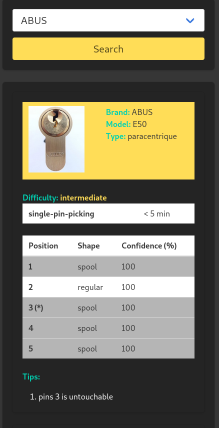

Start the application:
```
$ export FLASK_DEBUG=1
$ export FLASK_APP=app
$ flask run -h 0.0.0.0 -p 5000
```

If you lockpick a lock with success and want other people to do the same as you, you could fill the __locks.json__ file.

The application will display some tips about the lock:

* How many pins?

* How many security pins? and position, and shape

* Which method to use to unlock?

* The difficulty

* Some tips


